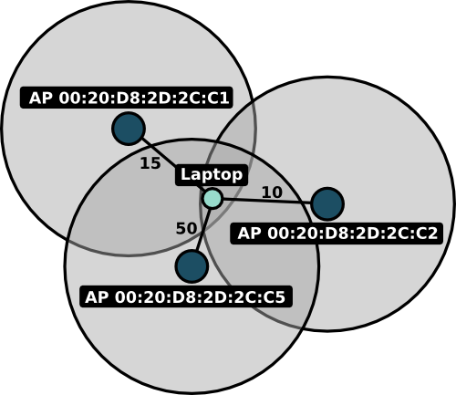

Overview
********

Theory
======
Large institutions like universities and businesses often have multiple wireless access points (\ *AP*\ s) with overlapping areas of influence:

In this example, a laptop is surrounded by three wireless access points, each identified with a unique
MAC address (\ *BSSID*\ ) of the form ``xx:xx:xx:xx:xx:xx``. The black numbers next to the lines connecting the laptop in the diagram represent the
*signal strength* of each access point. This value is affected by the distance between the laptop and an access point as well as obstacles
between the devices, wireless interference, the type of wireless card in the laptop, and a variety of other factors. Nonetheless, with enough
nearby access points and a database of past signal strengths and locations, we can convert a set of signal strength measurements into an ``x,y``
coordinate on a map.

The marauder's map client is a simple piece of software that periodically broadcasts the set of nearby access points and their corresponding
access points to a central server, which is then able to display the location of every user of the system on the marauder's map ui. It also
allows users to explicitly *bind* a set of signal strengths to a manually specified location. Every time a user does this, the accuracy of the 
system improves.

How Stuff Fits Together
=======================
The Marauder's Map client currently consists of 4 files:

    * :doc:`mapclient.py </mapclient>`
        The master file, which sets up the graphical user interface and makes calls to the 
        api as appropriate.

    * :doc:`configuration.py </configuration>`
        Defines global settings for the client api, such as which server to use and the
        web address of the map.

    * :doc:`api.py </api>`
        The client api that makes calls to the server and obtains signal strength data via :doc:`signal_strength.py </signal_strength>`.
        For example, the methods :py:meth:`api.post_location` and :py:meth:`api.weak_post_location` communicate with the server 
        in order to update a user's location on the map.

    * :doc:`signal_strength.py </signal_strength>`
        Defines operating system independent calls to get signal strength data.

